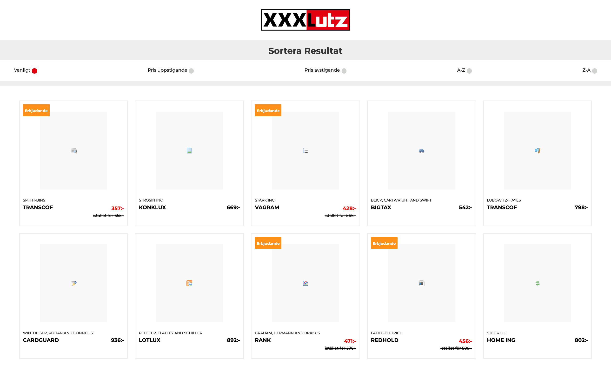

# XXXLutz Frontend Exercice

This repository contains my solution to the frontend exercice proposed by XXXLutz Digital

See deployed version [here](http://bloody-mouth.surge.sh)



## Instructions

The product owner wants you to implement a search result page for XXXLutz (Sweden):

The initial data is organised as a JSON object and can be fetched from https://api.myjson.com/bins/rl7ac (the API is CORS enabled).
It contains **100 products** and all required information you will need.

Implement the product list in React considering the following requirements:

- Write pure/stateless components wherever possible
- the layout should be fully responsive, please find a suitable way to arrange the information accordingly
- size of the page and required resources are important, be cautious with the resulting bundle size
- implement lazy loading of images
- _optional:_ add sorting functionality for price, popularity and name

Hints:

- feel free to use a any boilerplate such as `create-react-app`
- use (S)CSS, CSS-in-JS or whatever you prefer


## Instalation

Install dependencies: 
```sh
npm i
```

Run the app: 
```sh
npm start
```

Want to build the app for production?: 
```sh
npm run build
```

Demo is available at http://bloody-mouth.surge.sh


## Testing

To launch test: 
```sh
npm test
```

To check test-coverage: 
```sh
npm test-coverage
```